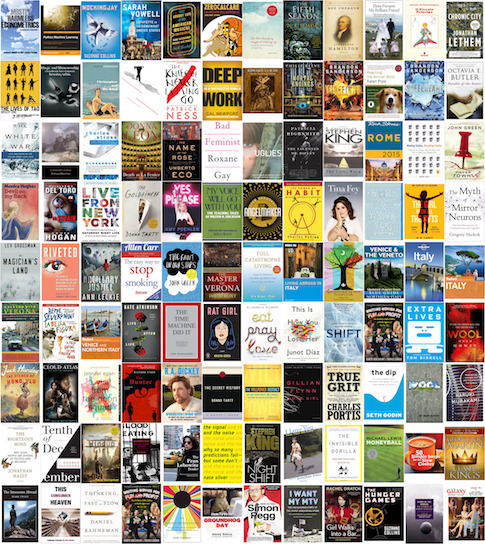

# E-Book Collection Poster

One of my acute pleasures in life is snooping the books in other people's bookshelves - and showing off the books in mine. Now that I mostly read e-books, I don't have an easy way to share which books I've read (or once intended to read, which I believe deserves almost as much credit). So I built this command-line tool, which makes a printable or displayable poster from your collection of e-books.

## Requirements
Using this program has three big requirements/limitations and one small one.

* Your e-books must be stored as files on your hard drive, and must not have any Digital Rights Management on them. This is a type of encryption that prevents access to the contents of an e-book except for by a branded e-reader. You can read up on this online, as well as how to remove DRM from the books you own. If you have some with and some without, the program will still work; it will just skip the books with DRM.

* It only works on Kindle books, that is, in files with extensions `.azw3`, `.azw`, or `.mobi`. Other file types can be converted to mobi, using something like [Calibre](http://calibre-ebook.com/), if they don't have DRM.

* You must [install ImageMagick](https://www.imagemagick.org/script/binary-releases.php), an open-source command-line program that does the image manipulation. This can be a bit tricky if you're not used to installing command-line tools, but you can at least try the instructions on the website.

* You must have Python installed, along with NumPy and pandas.

## How to Use

To create a virtual bookshelf poster, there are two steps. After opening up the terminal and navigating to the book covers directory:

1) **Extract the book covers**

Call 

```
python extract_book_covers.py ~/mybookfolder ~/myotherbookfolder  [etc.]
```

where `~/mybookfolder` is the path to your folder containing non-DRMed books with `.azw3`, `.azw`, and `.mobi` extensions. The utility will extract the covers from each book, and put them as image files into a folder called `covers`.

2) **Generate the poster**

Call 

```
python make_tiled_covers_image.py 
```

The utility will take those book covers and tile them into a high resolution image, called `tiled_covers.jpg`, with the top left the most recently downloaded e-books (by file creation date), and the bottom right the oldest books.

My algorithm makes the resulting image roughly poster-shaped in its aspect ratio. You can adjust this, for example if you would like to make less white space on the last row, or to make a landscape-oriented image suitable for displaying as a computer or TV screensaver, with a numerical command-line argument:

```
python make_tiled_covers_image.py 1.5
```

1.2 is the default, somewhat portrait format, while larger numbers are wider and smaller numbers are taller.

## The problem of missing book covers

You'll likely notice when you look at your completed poster that many of the books don't have their proper cover. It might looks something like this:


My theory for this is that Amazon prepares e-books sometimes before the cover is finalized, and so you get a temporary cover instead. I found this for at least 1/3 of my official Amazon Kindle books. 

You can fix these covers by downloading images of the cover from somewhere, such as the Amazon preview image, and saving them with the same name as the original cover file for that book in the `covers` folder. I do it by directly saving the image directly from my browser to the folder, clicking on the name of the relevant file to replace to fill in the name. 

Another problem is that you may see books in your book cover poster that you don't necessarily want to show off. Simply delete those cover images from the `covers` folder. This also provides another way to eliminate white space from the bottom of your poster, by selectively deleting items until the number of rows and columns are a divisor of the number of covers.

Once the `covers` folder is just how you want it, simply run `python make_tiled_covers_image.py` again.

Is doing all these steps time consuming and obsessive? Yes. But if you're the type to enjoy rearranging your bookshelves anyway (I am), this should provide just the same kind of enjoyment, and the same satisfaction with the final result. Here's my poster:



[Full size version](example_poster.jpg)

You can regenerate your poster with additional books, and it will not overwrite any cover images you manually replaced. However, you will have to delete the covers you deleted before again.

This was written by Daniel Saunders, and makes use of code from [KindleUnpack](https://github.com/kevinhendricks/KindleUnpack):
	
    Based on initial mobipocket version Copyright © 2009 Charles M. Hannum <root@ihack.net>
    Extensive Extensions and Improvements Copyright © 2009-2014 
         By P. Durrant, K. Hendricks, S. Siebert, fandrieu, DiapDealer, nickredding, tkeo.
    This program is free software: you can redistribute it and/or modify
    it under the terms of the GNU General Public License as published by
    the Free Software Foundation, version 3.

